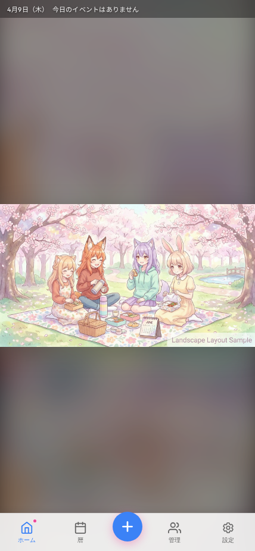
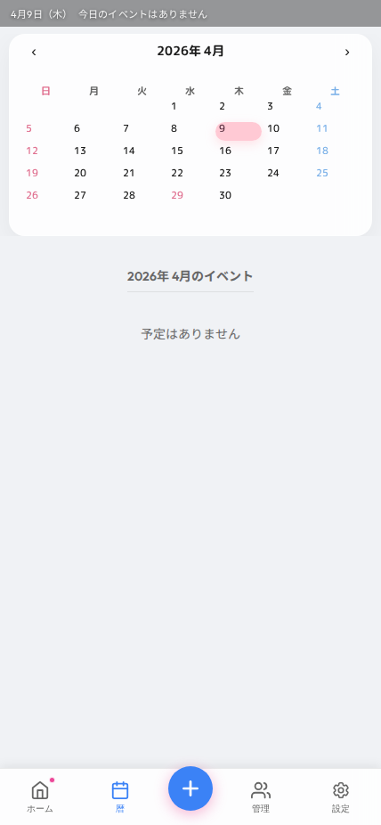
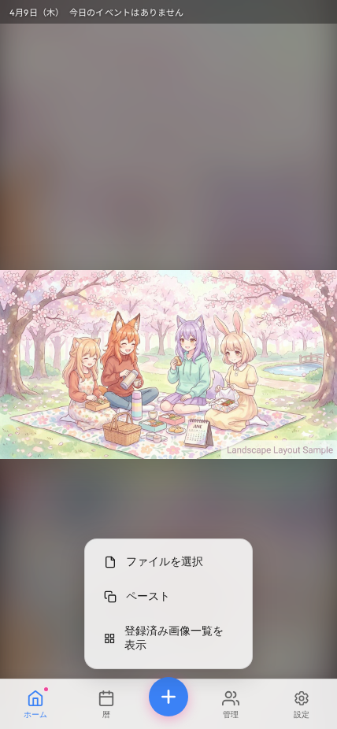
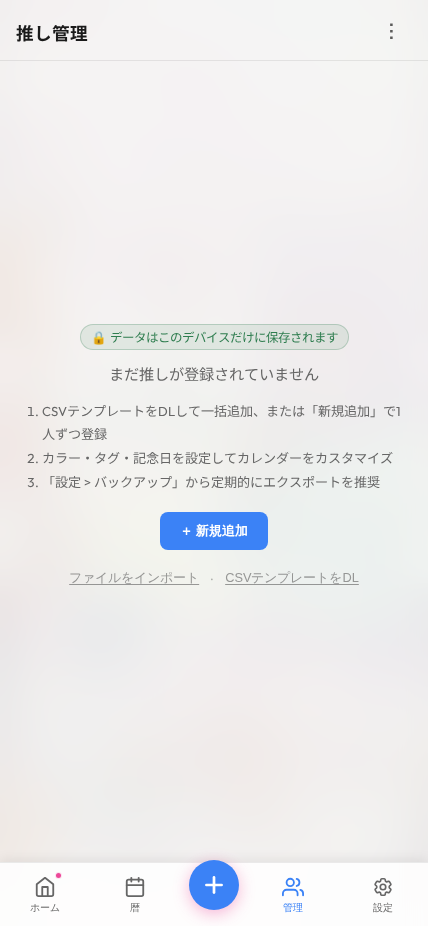
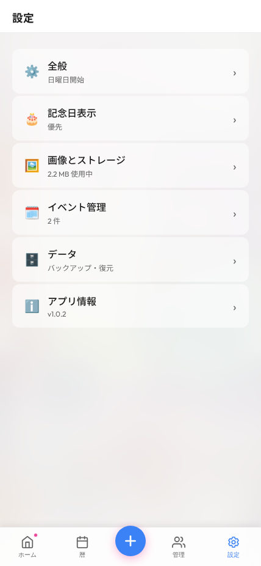

# 推しコヨ (Oshikoyo) - スマホ版 ユーザーマニュアル

推しコヨへようこそ！このマニュアルでは、スマートフォンで「推しコヨ」を快適に使うための基本的な操作方法を解説します。

## 1. 画面の基本レイアウト

スマホ版は、片手でも操作しやすいように**画面下部にナビゲーションタブ（ボトムナビゲーション）**が配置された専用の画面構成になっています。

画面の下にある5つのボタンをタップすることで、アプリ内の各機能に素早くアクセスできます。

---

## 2. 下部ナビゲーションの各機能

### ホームタブ
アプリを開いた時の基本画面です。
登録した推しの画像が全画面で美しく表示され、画面上部には今日の日付やテロップが表示されます。

### 暦（カレンダー）タブ
カレンダーを確認するタブです。

- 登録した推しの記念日やイベントが一目でわかります。
- 日付をタップすると、その日の詳細や画像が表示されます。
- スワイプ操作で前後の月に移動することもできます。

### 追加（＋）ボタン
画面中央の大きな「＋」ボタンをタップすると、メニューが開き、推しや画像の新規登録が素早く行えます。

### 管理タブ
登録している「推し」の一覧を管理する画面です。

- 新しい推しを追加したり、既存の推しの情報を編集・削除できます。
- リストから特定の推しを検索したり、並べ替え（登録順、名前順、記念日順）ることも可能です。
- 右上のメニュー（︙）からは、CSV形式での一括インポートやエクスポートが行えます。

### 設定タブ
アプリ全体の動作や見た目をカスタマイズする画面です。

- **全般**: アプリのテーマカラーやカレンダーの表示設定を変更します。
- **データとバックアップ**: アプリのデータをエクスポート（保存）したり、復元したりします。初期化もここから行えます。
- その他、イベント設定や画像に関する詳細な設定が行えます。

---

## 3. 推しと画像の追加方法

1. **推しを登録する**: 下部の「管理」タブを開き、「＋ 新規追加」をタップします。名前やカラー、タグ、記念日を入力して保存します。
2. **画像を登録する**: 中央の「＋」ボタンから画像追加を選択するか、カレンダーやホーム画面に表示される画像ライブラリ機能から、スマホ内の写真をアップロードします。
3. 画像にタグを付けることで、特定の推しや記念日に関連付けて表示させることができます。

---

## ⚠️ 重要：データの保存とバックアップについて

推しコヨは、**すべてのデータ（推し情報、画像、設定など）をご利用のスマートフォンのブラウザ内部にのみ保存します。** 外部のサーバーには一切送信されません。

そのため、以下の点に十分ご注意ください：

1. **SafariやChromeなどのブラウザの履歴・キャッシュを削除したり、プライベートブラウズモードで利用すると、データが消去される**場合があります。
2. アプリとしてホーム画面に追加（PWAとしてインストール）してのご利用をおすすめします。
3. 万が一（機種変更やデータ消失）に備えて、**「設定」>「データ」から定期的に「全データをバックアップ」**し、バックアップファイルをお手元のスマートフォン内のファイルアプリ等に保存しておくことを強く推奨します。
4. 著作権・肖像権のある画像のご利用は、ご自身の判断と責任において行ってください。
