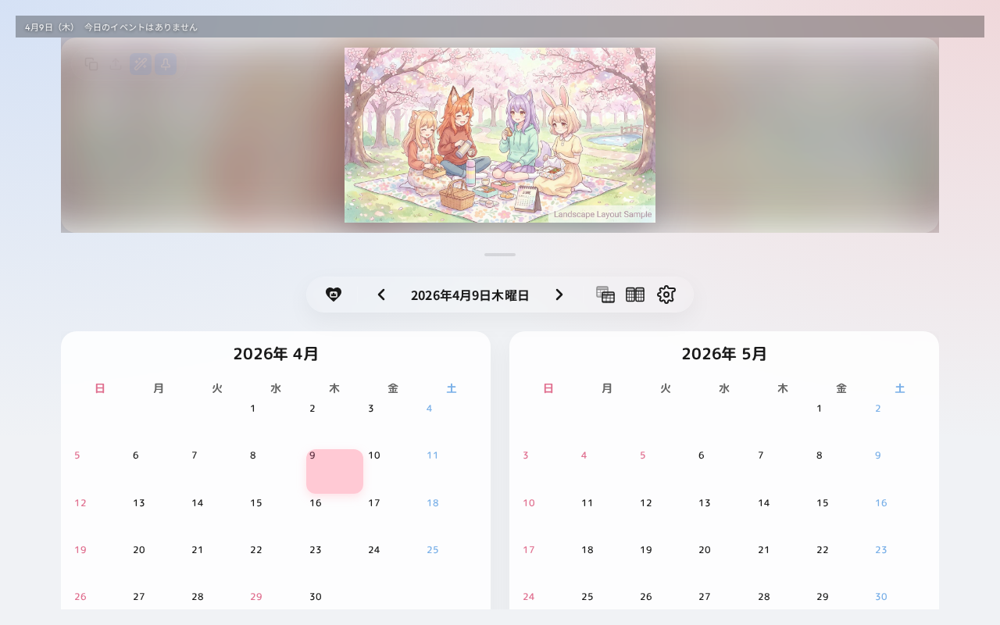
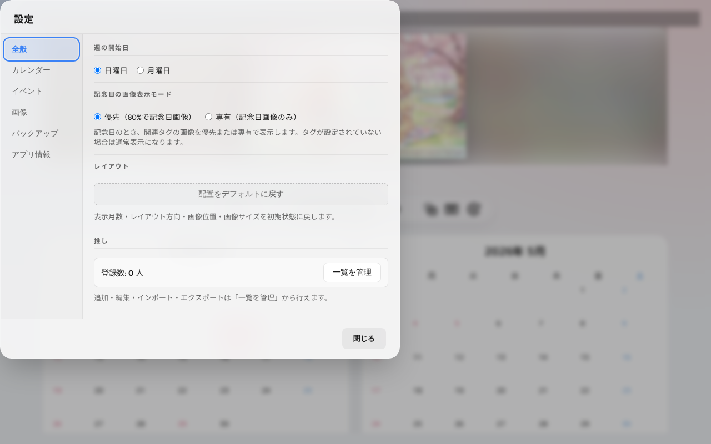

# おしこよ (Oshikoyo) - PC版 ユーザーマニュアル

おしこよへようこそ！このマニュアルでは、PCブラウザで「おしこよ」を使うための基本的な操作方法を解説します。

## 1. 画面の基本レイアウト

PC版のおしこよは、画面を左右2つのエリアに分けた構成になっています。

- **左側（カレンダー・操作パネル）**:
  カレンダーの表示、推しの追加、画像のアップロードなど、メインの操作を行います。
  - **上部メニュー**: 今日ボタン、レイアウト変更、推しリストのトグル、設定ボタンなどが並びます。
  - **カレンダー**: イベントや記念日を確認できます。
- **右側（画像プレビュー・詳細表示エリア）**:
  カレンダーで選択した日のイベント詳細や、登録した推しの美しい画像を大画面で楽しむことができます。

---

## 2. 推しとイベントの管理

### 推しの追加
1. 画面上部の **「推しリスト」ボタン**（人型のアイコン）をクリックして、推しリストパネルを開きます。
2. **「＋ 新規追加」** ボタンをクリックします。
3. 推しの名前、カラー、関連タグ、記念日を入力して保存します。

### CSV一括インポート

複数の推しをまとめて登録したい場合は、CSV形式のファイルでインポートできます。

1. 推しリストパネル右上の **「︙」メニュー** から **「CSVテンプレートをダウンロード」** をクリックします。
2. ダウンロードしたファイルを編集ツールで開き、推しの情報を入力します。
3. 同メニューの **「CSVでインポート」** からファイルを選択するとインポートされます。

#### 日付の書式
誕生日・記念日などの日付は **`M/D`（例: `3/21`）または `YYYY/M/D`（例: `2019/9/1`）** の形式で入力してください。

> ⚠️ **Excelで編集する場合の注意**
>
> Excelは `3/21` などの値を自動的に「日付型」として認識し、保存時に `3月21日` のような形式に変換してしまうことがあります。この形式はアプリが認識できず、日付がインポートされません。
>
> **回避方法：**
> - 保存形式は必ず **「CSV UTF-8（コンマ区切り）」** を選択してください（「CSV（コンマ区切り）」では文字化けが発生します）。
> - Excelで開く際は「データ」タブ →「テキストファイルからインポート」を使用し、日付列を**テキスト形式**として読み込んでください。
> - または **Google スプレッドシート** をご利用いただくと自動変換が起きにくくなります。

### カレンダー機能
- カレンダー上の日付をクリックすると、その日に登録されている記念日や、追加したメモ・イベントが右側のパネルに表示されます。
- 右上のレイアウト変更ボタン（四角いアイコン）から、カレンダーの配置を左右や上下に切り替えることも可能です。
  - **レイアウト**: 画像の配置をスマート（自動） / 上 / 下 / 左 / 右から選択可能
  - **没入モード**: 画像がフルスクリーンで表示され、UIはマウスオーバー時のみ表示されるモード

---

## 3. 画像の追加と管理

おしこよでは、ローカルの画像ファイルを登録して、カレンダーやプレビューエリアで表示させることができます。

1. カレンダー下部、または推しリストパネル内にある画像ライブラリ（ギャラリー）にアクセスします。
2. 以下のいずれかの方法で画像をアップロードします：
   - ファイル選択
   - ドラッグ＆ドロップ
   - クリップボード貼り付け（Chrome / Edge）
   - フォルダ一括登録（デスクトップ Chrome / Edge）
3. 追加した画像にタグを設定することで、特定の推しや記念日に関連付けることができます。
   > **記念日連動**: 記念日当日は、その推しのタグが付いた画像が **優先**（80%の確率）または **専有**（その画像のみ）で表示されます（「設定」>「全般」タブから切り替え可能）。

### 画像表示の設定

画面右上の **「表示モードの設定」ボタン**（ピン留め・ランダム・サイクルのアイコン）をクリックすると、画像エリアの表示動作に関する設定が行えます：
- **表示モード**: ランダム / サイクル（登録順） / 手動（ピン留め）から選択できます。
- **切り替え間隔**: 10秒〜毎日4:00まで設定可能です。

---

## 4. 設定とバックアップ

画面右上の **「歯車アイコン（設定）」** をクリックすると、設定画面が開きます。

設定画面は6つのタブに分かれており、以下のことができます：
- **全般**: 週の開始日、記念日の画像表示モード（優先/専有）、レイアウトリセットなど
- **カレンダー**: 祝日データの同期
- **イベント**: カスタムイベントタイプの追加・削除
- **画像**: 画像追加、ストレージ管理、全画像の圧縮・削除
- **バックアップ**: アプリの全データのエクスポート・復元、全データの初期化
- **アプリ情報**: 使い方やバージョンの確認

### バックアップの種類
バックアップには2種類あります。用途に合わせて使い分けてください：
- **フルバックアップ**: 全データを書き出します。復元時は既存データが**完全置換**されます。
- **画像+タグパッケージ**: 画像とタグ情報のみを保存します。復元時は既存データに**マージ**（追記）されます。

---

## ⚠️ 重要：データの保存とバックアップについて

おしこよは、**すべてのデータ（推し情報、画像、設定など）をご利用のブラウザ内部（ローカル環境）にのみ保存します。** 外部のサーバーには一切送信されません。

そのため、以下の点に十分ご注意ください：

1. **ブラウザの履歴やキャッシュを削除（シークレットモード等での利用）すると、データが消去される**場合があります。
2. 万が一に備えて、**「設定」>「バックアップ」から定期的にフルバックアップ**して、バックアップファイル（.zip等）をお手元のパソコンに保存しておくことを強く推奨します。
3. 著作権・肖像権のある画像のご利用は、ご自身の判断と責任において行ってください。
